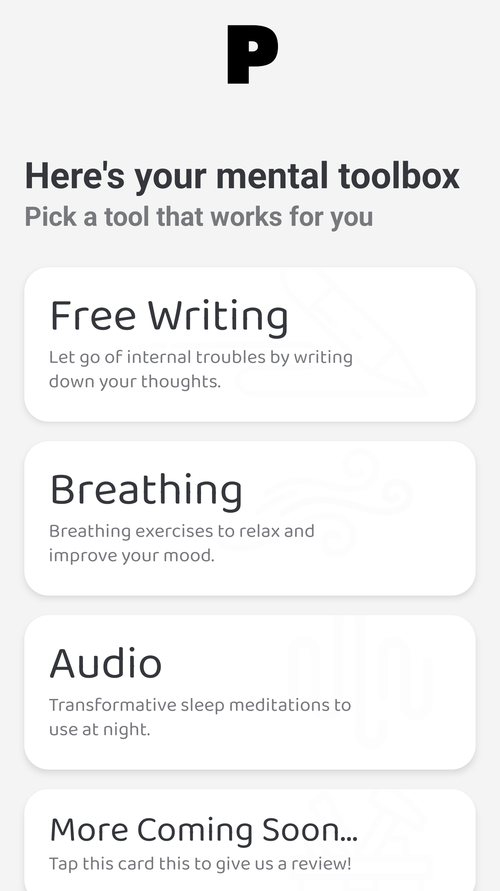
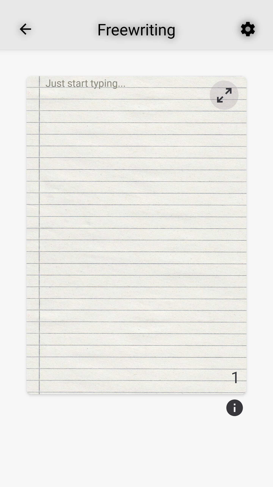
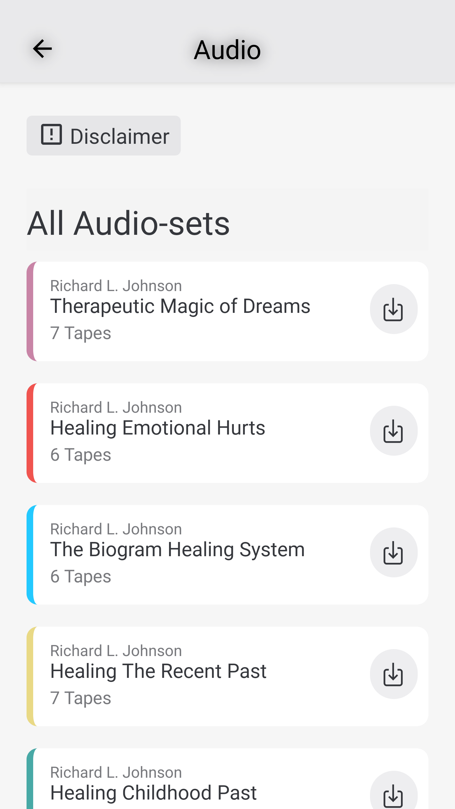
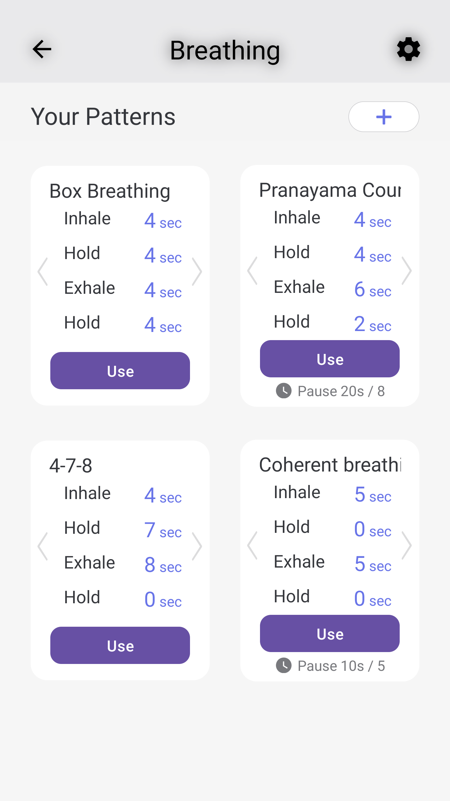

# PeaceBox: An App for Mental Wellness and Stress Management


PeaceBox is a comprehensive application designed to assist with mental wellness and stress management. Through a variety of features such as free writing, guided breathing, and soothing audio experiences, PeaceBox aims to bring a sense of peace to your daily life.

---

## Table of Contents

1. [Features](#features)
2. [Screenshots](#screenshots)
3. [Getting Started](#getting-started)
    - [Prerequisites](#prerequisites)
    - [Installation](#installation)
4. [Development](#development)
    - [Website](#website)
    - [iOS App](#ios-app)
6. [License](#license)
7. [Contact](#contact)

---

## Features

- **Free Writing:** A space to freely jot down your thoughts and feelings.
- **Guided Breathing:** Interactive breathing exercises to help you relax.
- **Soothing Audio:** Curated audio tracks designed to reduce stress and anxiety.
- **And More:** Stay tuned for upcoming features!

---

## Screenshots

|  |  |  |  |
|:---------------------------------------------------------------------:|:--------------------------------------------------------------------------:|:-----------------------------------------------------------------------------:|:------------------------------------------------------------------------------:|
|                              Home Page                                |                               Free Writing                                |                                Audio Page                                   |                              Breathing Page                                  |

---

## Getting Started

### Prerequisites

- Node.js v16 or higher is required to build this project.

### Installation

1. **Clone the repository:**

    ```bash
    git clone https://github.com/NeagDolph/peacebox.git
    ```

2. **Navigate to the web directory and install the necessary modules:**

    ```bash
    cd web/web-svelte
    npm install
    ```

3. **Install and set up Firebase CLI:**

    ```bash
    npm install -g firebase-tools
    firebase login
    firebase projects:list
    firebase use PROJECT_ID|ALIAS
    ```

    For more details, check the [Firebase CLI Reference](https://firebase.google.com/docs/cli).

---

## Development

### Website

1. **Run in development mode:**

    ```bash
    npm run dev
    ```

2. **Build the website:**

    ```bash
    npm run build
    ```

3. **Deploy to Firebase:**

    ```bash
    cd ../..
    npm run deploy
    ```

### iOS App

- Information coming soon. Meanwhile, you can follow this [React Native Environment Setup Guide](https://reactnative.dev/docs/environment-setup) but skip the `Creating a new application` section.

---

## License

This project is licensed under the MIT License. See [LICENSE.md](./LICENSE.md) for details.

---

## Contact

For any queries, feel free to reach out to us at [contact@peacebox.app](mailto:contact@peacebox.app).
